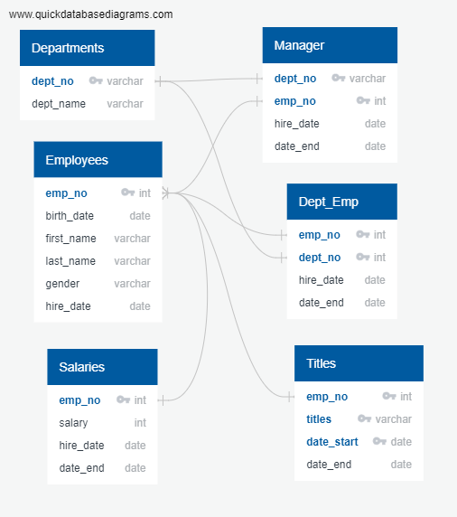
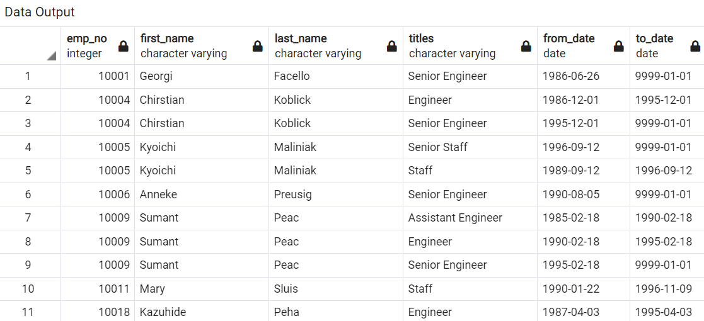
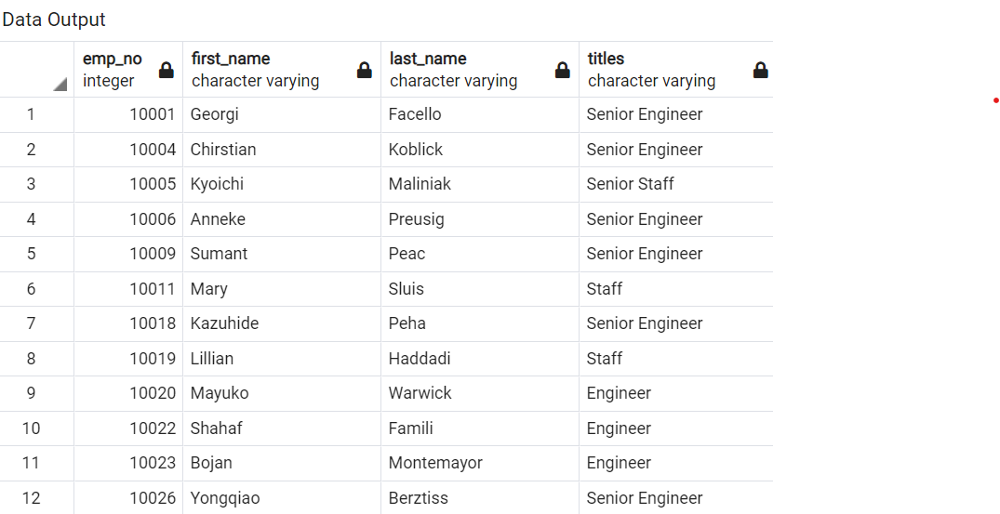
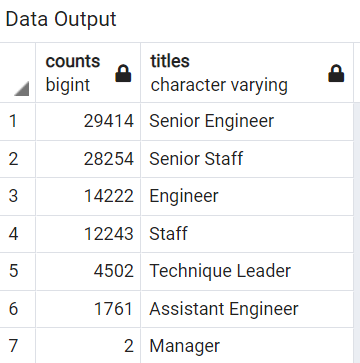
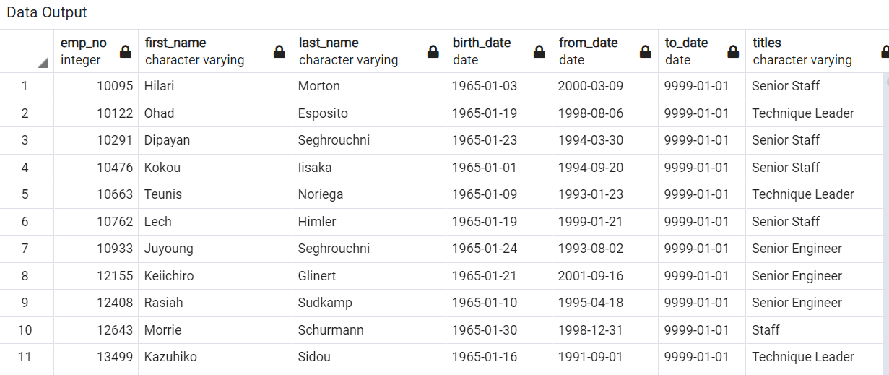

# Pewlett-Hackard-Analysis: Upcoming "Silver Tsunami"
### **Overview of the Analysis**

The objective of this project is to analyze the employee information database for a large company, Pewlette-Hackard (PH) that was founded several years ago. The company has many baby boomer employees who are ready to retire. PH will offer a retirement package to the employees who meet certain criteria. PH is also looking ahead to see which positions need to be filled soon. We helped Bobby, the Human Resources analyst perform employee research. 

From a list of about 500,000 employees, we retrieved the information about the number of employees retiring soon based on their age. We used the employee information such as employee number, employee name, date of birth, department they are currently working, date of hire, job title and their salaries. By combining the data from different database in various ways we are able to find 
1) The employees retiring soon, the department they worked in. A rehire will be needed for those departments if the number of retiree is high. 
2) The employees who were born in the year 1965. These employees are eligible for Mentoring offered by the Pewlette-Hackard compnay.

### **Analysis**

The employee data is stored in six csv files. We created a database and investigated the relationship between different data using SQL (Structured Query Language) which is a query language. We used _Postgres_ SQL which is a Database system for holding data and _pgAdmin 4_, the interface that communicates with Postgres. We wrote our query statements to perform the analysis in pgAdmin4.

There were six csv files: departments, employees, dept_manager, dept_emp, salaries and titles. We created an **Entity Relation Diagram** (ERD) which acts like a pseudo code for a visual outline of the database. We built a schema using an online tool _Quick DBD_  from the website: https://www.quickdatabasediagrams.com/
We assigned Primary Keys, Foreign Keys and Data types and established relationship between different csv data file as shown in Fig 1. We created six tables from the CSV files in pgAdmin.

**Fig 1:** The figure shows ERD for the six CSV files provided to us from Pewlette-Hackard. 

### **Deliverable 1: Number of Retiring Employees by Title**

The goal is to create a list of employees who were born between Jan 01, 1952 and Dec 31, 1955. These employees are eligible for a retirement package. The SQL query file is saved in the file _Employee_Database_challenge.sql_ in the _Queries_ folder. We identified the employees the following way.

 - We chose data from _employees.csv_ and _titles_. We performed an "_INNER JOIN_" to merge the data without any blank rows. The data is filtered to employees with birth date between Jan 1, 1952 and Dec 31, 1955. We saved the table in _retirement_titles.csv_ file in the _Data_ folder. See Fig 2 for top 11 rows of the data output in pgAdmin. Some employees appeared multiple times since they moved into different departments within the company.

 

 **Fig 2:** The output of employee information filtered by their birthdate. 

- We removed multiple occurrence of the same employee name using _DISTINCT ON_ to obtain a unique employee name table. We created a csv file to contain this data. Fig 3 below shows the top 12 rows of output data in pgAdmin.

**Fig 3:** This figure shows top 12 rows of the output data from pgAdmin.

- We retrieved the number of job titles that will lose employees due to retirement using _COUNT_ in our query. We sorted the data in descending order and saved the data in _retiring_titles.csv_ file. Fig 4 shows the output in pgAdmin. 

**Fig 4:** The figure shows the employee count by titles in descending order. 

### **Deliverable 2: The Employees Eligible  for the Mentorship Program**

PH offers a mentorship program to the employees of certain age. We searched for current employees who were born on 1965. We did _INNER JOIN_ of the files _employees.csv_ and _titles.csv_ to obtain, employee number, first name, last name, birth date, start date and the end date. Only current employees are eligible for this program. We filtered out the employee who left the company by querring the employees with end date in far in the future, "9999-01-01". By making the "end date" far in the future ensures that this same query can be used for upcoming years without changing the "end date". The output file is stored in _mentorship_eligibility.csv_ file. Fig 5. shows the output data from pgAdmin.

 

**Fig 5:** The figure shows the data output of the top 11 rows of current employees born on 1965. Note that the "to_date" is in the future to ensure that these employees are currently employed. 

## **Summary**

There are about 500,000 employee data in the csv data files. Much of the data is not useful for the retirement and hiring consideration. There are about 240,000 employees currently employed with a unique job title. According to the data in _retiring_titles.csv_ about 90,000 employees are retiring. This is about 37.5% of the employee, which is a substantial workforce. Seven departments are losing employees and they are: Senior Engineers (29,414), Senior Staff (28,254), Engineer (14,222), Staff (12243), Technique Leader (4,502), Assistant Engineer (1,761) and Manager (2). It is apparent that Senior Engineers and Senior Staff needs more hiring position than some of the other departments. There are 1,549 employees born in 1965 who are eligible for being mentored. These employees can work for at least ten more years before considering retirement. Many employees at this age are probably eligible for a senior position if a higher position will be vacant. These people can fill in some vacuum that will be created from the retiring employees. The retiring employees were born between 1952 and 1955. If the company wants the retiring employees to be the mentors, then there are should not be any problem since the number of retiring employee is more than the number eligible for mentoring. It depends upon which department the 1965 born belongs to. The company Pewlette-Hackard will need to advertise for new hire to fill in the vacant post of Engineers and Technicians as well as other departments. 

There are only two Managers retiring. This number may be small, but it is also a position with a lot of resposibilities. The company will need to hire people with more experience, which could be moving people around within the company or advertising for it. PH will need to advertise for job position in all the departments whether the employees are shuffeled from within the company, or a new hire. Any employee shuffling will also create a need for filling up those positions. 

